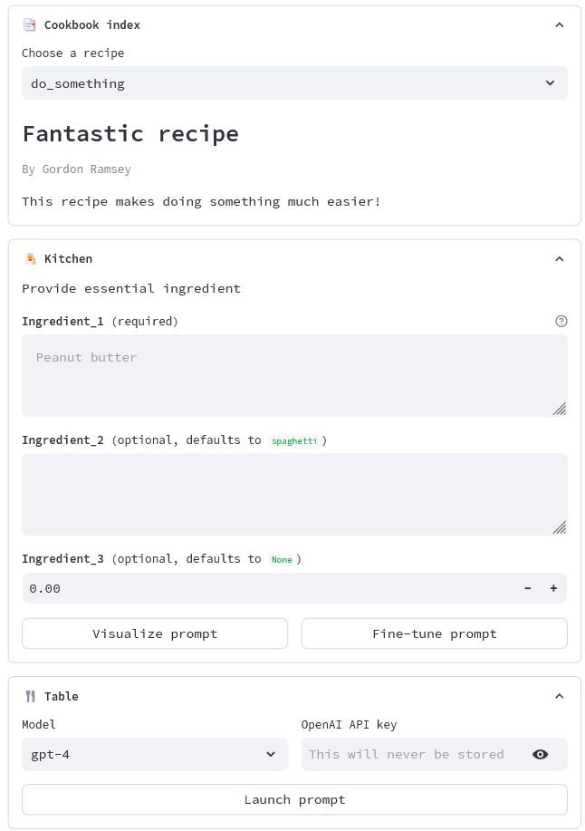

# Promptbook UI

Do you find yourself writing the same prompts again and again into ChatGPT?
Work your most used prompts into a comfy graphic user interface with just a few lines of code.

Promptbook allows you to:
 - Have a customizable UI from a simple prompt-building Python function
 - Store your prompts and use the recipes created from the community

## How to use
TODO

## Build your recipe
Use the template in `recipes/do_something.py` and take it from there. The code
```python
# the recipe: build your prompt with required, default and optional inputs
def do_something(
        ingredient_1: str,  # required ingredient
        ingredient_2: str = "spaghetti",  # required ingredient with a default value
        ingredient_3: int = None,  # optional ingredient (use `[]` for lists)
) -> str:
    prompt = f"""
This is the base prompt.  
It uses the mandatory ingredient {ingredient_1}, which MUST be filled by the user.
""" # This is ugly indenting, but it really helps visualizing the prompts
    # Indenting / new lines do not have impact on GPTs response

    if ingredient_3 is not None:
        prompt = prompt + \
                 f"Here I add the optional ingredient {ingredient_3}, only in case the user fills it."

    prompt = prompt + \
             f"Here I add {ingredient_2}, which will be spaghetti if the user does not fill it."

    return prompt


# optional user interface details
# feel free to use as many as you want
_title = "Fantastic recipe"  # a descriptive title for your recipe
_author = "Gordon Ramsey"  # your name or github user
_description = "This recipe makes doing something much easier!"  # what the recipe does / use cases
_ui = {  # additional UI information for each ingredient
    "ingredient_1": {  # must have the same name as the function argument it refers to
        "text": "Provide essential ingredient",  # some explanatory text written before the input field
        "help": "This is very important",  # a helper text shown on hover
        "suggestions": "Peanut butter",  # some examples to show in the input placeholder
    },
}
```
will automatically be transformed into:
